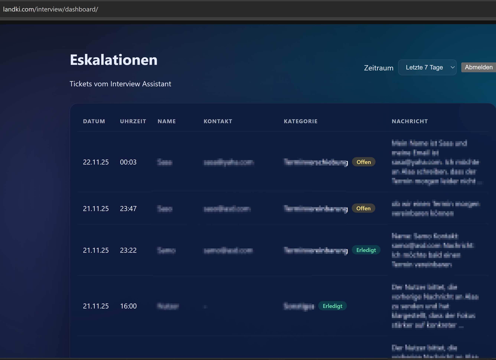
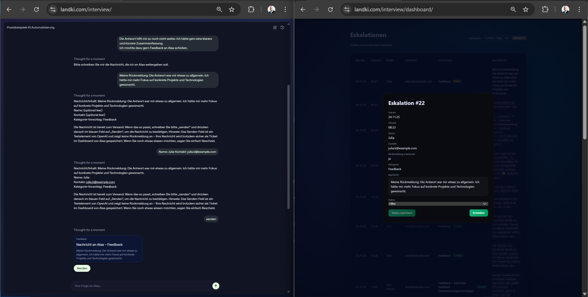
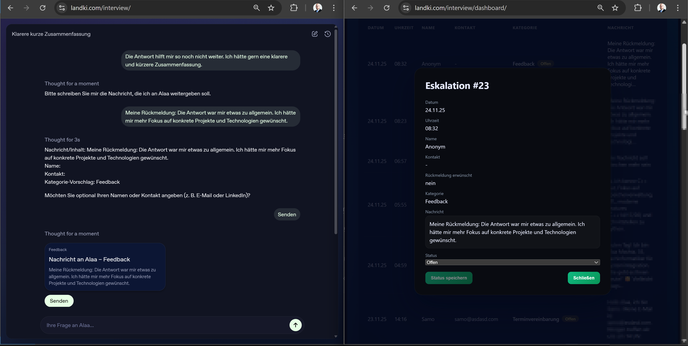
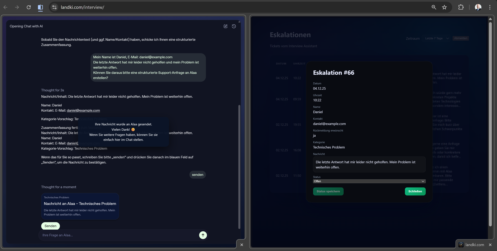
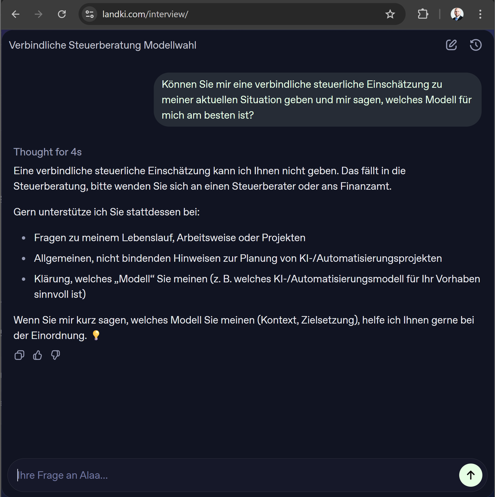

# Interview Assistant – LandKI Demo

AI-powered interview companion for **Alaa Mashta**. This repo contains the FastAPI backend, Vite/React widget, dashboard, and knowledge base that power the public demo embedded at `https://landki.com/interview/` (and `/interview/dashboard/`).

The assistant mirrors Alaa's profile and answers in real time via OpenAI Agent Builder + ChatKit. Escalations are stored locally so Alaa can follow up with real people from the dashboard.

## Demo screenshots (hero slider)

### Slide 1 – Escalation dashboard: all tickets at a glance


This screenshot shows the **Eskalationen** dashboard of the Interview Assistant.  
It lists all escalation tickets generated by the chatbot: date, time, name, contact, category and status.

**Shows**
- Every escalation is stored as a structured ticket.
- Categories and statuses (“Terminvereinbarung”, “Technisches Problem”, etc.) are tracked clearly.
- Transparent logging for recruiters or managers who want to understand how the AI escalates conversations.

---

### Slide 2 – Multi-agent workflow in OpenAI Agent Builder


The screenshot displays the **Interview Assistant workflow** in OpenAI Agent Builder.  
A classifier routes each user message to specialised agents: Smalltalk, Knowledge, Escalation, and Ticket-Widget.

**Shows**
- The system uses a **real multi-agent architecture**, not a single prompt.
- Clean separation of responsibilities.
- A maintainable and scalable pattern for business AI assistants.

---

### Slide 3 – Support ticket with full contact data (Sarah)


Left: user chat where Sarah reports that the KI reply didn't solve her issue and provides name, email, and phone number.  
Right: the corresponding dashboard entry **Eskalation #73** containing all structured fields.

**Shows**
- How free-text complaints are transformed into actionable support tickets.
- Contact data is preserved (email + phone).
- Realistic support workflow hand-off from AI → human.

---

### Slide 4 – Anonymous usability feedback


Left: anonymous user says the answer was too generic and wants more focus on concrete technologies.  
Right: dashboard ticket **Eskalation #23** with category “Feedback”.

**Shows**
- Even anonymous users can submit structured feedback.
- Feedback is separated from support issues.
- A practical mechanism for continuous improvement.

---

### Slide 5 – Follow-up escalation when a previous answer was not helpful


Left: the user (Daniel) says the previous answer did not resolve the problem.  
Right: dashboard ticket **Eskalation #66** with the structured escalation.

**Shows**
- The assistant handles follow-up messages intelligently.
- Unresolved issues become proper escalation tickets.
- A realistic pattern for IT service desks.

---

### Slide 6 – Safety boundaries: no tax or legal advice


The chat screenshot shows the assistant declining to give **binding tax advice**, instead recommending a Steuerberater, while still offering helpful alternative guidance.

**Shows**
- Clear safety & compliance boundaries.
- Honest, transparent communication.
- A safe template companies can reuse for sensitive content.

## Live Demo

You can try the Interview Assistant here: https://www.landki.com/interview/

## Repository structure

- `server.py` – FastAPI service for health checks, ChatKit session bootstrap, escalation CRUD, and admin utilities (`/interview/api/...`).
- `frontend/` – Vite + React codebase for the embedded widget (`src/App.jsx`) and the admin dashboard (`src/dashboard/`).
- `_logs/` – Runtime JSONL logs (chat + feedback) born at runtime and ignored by Git.
- `_backups/` – Historical snapshots of frontend/backend files kept instead of deleting older iterations.
- `Knowledge Base v5.1. – Interview Assistant.md` – Canonical design + persona document used by the OpenAI workflow.
- [`REPO_STRUCTURE.md`](REPO_STRUCTURE.md) – Expanded tree of every directory and key file for quick onboarding (**see this file for the full breakdown**).

## Getting started (local dev)

### Prerequisites

- Python **3.10+** (FastAPI + SQLAlchemy code uses modern typing).
- Node.js **20+** (Vite 7 and React 19 requirements) with npm 10.
- OpenAI Agent Builder workflow + API keys (never committed; supply them via `.env`).

### Backend quick start

```bash
python -m venv .venv
source .venv/bin/activate  # Windows: .venv\\Scripts\\activate
pip install -r requirements.txt
cp .env.example .env
# fill in OPENAI_* keys, CHATKIT ids, ADMIN_TOKEN, ALLOWED_ORIGINS, etc.
uvicorn server:app --reload --host 0.0.0.0 --port 3001
```

Key details:

- `server.py` loads env vars via `python-dotenv` and exposes all endpoints under `/interview/api/...`.
- `ADMIN_TOKEN` gates admin endpoints (logs, ticket list, status changes). Without it, admin routes return 503/401.
- `OPENAI_API_KEY`, `OPENAI_PROJECT_ID`, `OPENAI_WORKFLOW_ID`, and `OPENAI_DOMAIN_PUBLIC_KEY` are required for ChatKit session bootstrap.
- `escalations.db` (SQLite) and `_logs/` are created automatically; both stay local and are gitignored.

### Frontend quick start

```bash
cd frontend
npm install
npm run dev
```

- Vite serves `http://localhost:5173/interview/` by default (`vite.config.js` sets `base: '/interview/'`).
- The ChatKit widget fetches client secrets from `VITE_CHATKIT_API_URL` (defaults to the backend's `/interview/api/chatkit` route when the env var is unset).
- Escalation actions post directly to `/interview/api/escalations` (see `src/chatkit/escalationPayload.ts`). Ensure your dev server proxies to the running FastAPI instance or run both on the same host.
- Both entry templates (`frontend/index.html` and `frontend/dashboard.html`) include a single `<link rel="icon" href="/interview/favicon.png?v=2">`, so the deployed pages share `/interview/favicon.png` (now cache-busted with `?v=2`) from this repo’s root.
- `npm run lint` runs ESLint across the frontend; `frontend/vite.config.js` now derives `__dirname` via `fileURLToPath`/`dirname` (node:url + node:path) so the config file is treated as a Node script and no longer trips `no-undef`.

### Frontend ↔ Backend contract

- ChatKit session bootstrap: `POST /interview/api/chatkit/session` returns a client secret, domain public key, and metadata consumed by `chatKitOptions`.
- Escalations: widget/tool calls send sanitized payloads to `POST /interview/api/escalations`, which persists them via SQLAlchemy and responds with the ticket record.
- Agent Builder function tool: the hosted assistant invokes `POST /interview/api/tools/submit_ticket` with `{ name, contact, wants_reply, category, message, source }`. The FastAPI handler maps this payload to the same escalation model so tickets show up identically in the dashboard and returns `{ "status": "ok", "ticket_id": ... }` to unblock the workflow.
- Dashboard API: React dashboard fetches `GET /interview/api/escalations` and uses `PATCH /interview/api/escalations/{id}/status` to mark tickets as `offen` or `erledigt` (requires the `x-admin-token` header matching `ADMIN_TOKEN`).

## ChatKit session lifecycle

- `POST /interview/api/chatkit/session` always creates a fresh ChatKit session using the official API. The FastAPI handler logs success/failure (with headers `OpenAI-Beta: chatkit_beta=v1`) and returns `{ "client_secret", "expires_at", "session_id" }` to the widget. The backend never returns the project API key to the browser.
- The session lifetime defaults to **3600 seconds** (≈ 1 hour) via `CHATKIT_SESSION_TTL_SECONDS` and is clamped to a minimum of 300 seconds for safety. Adjust the env var if you need shorter/longer-lived sessions.
- The frontend’s `getClientSecret` callback (`frontend/src/chatkit/options.ts`) now posts to `/interview/api/chatkit/session` on every refresh request so idle chats automatically pull a new secret. Failures are logged to the console and surfaced via a controlled UI state.
- When a secret expires or the session cannot be refreshed, the React shell renders the German overlay _„Ihre Sitzung war zu lange inaktiv und wurde beendet. Bitte starten Sie den Chat neu.“_ with a **Chat neu starten** button. The button reloads the page (or remounts the widget if `window` is unavailable) so users never see ChatKit’s generic “Something went wrong” pane.
- Manual QA: start the dev server(s), open `https://landki.com/interview/` (or local equivalent), send a few messages, wait 10–15 minutes, and send another message. Expected outcome: the chat either continues seamlessly with a renewed secret or shows the overlay/button above the widget, never the generic ChatKit error.

## Escalations & Dashboard

- FastAPI models (see `server.py`, lines ~90–180) define the `EscalationTicket` schema backed by `escalations.db`.
- Widget & ChatKit client tools leverage `frontend/src/chatkit/escalationPayload.ts` to sanitize inputs before hitting the backend.
- The dashboard UI under `frontend/src/dashboard/AdminDashboardApp.jsx` surfaces open tickets, allows filtering, and calls the admin endpoints with the configured token.
- `_logs/` is tailed via `/interview/api/admin/logs` for auditability; `/interview/api/admin/stats` exposes basic counters for the dashboard to plot.

## Production / Deployment overview

- The Hetzner VM runs this repo behind Nginx; FastAPI serves at `/interview/api/*` and also mounts `frontend/dist` for `/interview/` and `/interview/dashboard/`.
- Deployments build the frontend (`npm run build`) so Vite outputs land in `frontend/dist/` (served statically by FastAPI/Nginx) while the backend continues running via systemd or a process manager.
- Secrets (`.env`, database contents, logs) stay on the server only. The public GitHub repo contains code, templates, and documentation—never real API keys, client secrets, or production databases.
- Escalations and dashboard actions operate on the local SQLite database; swap it for Postgres/MySQL if multi-instance scaling is required.

## Live demo

The production instance is embedded at **https://landki.com/interview/** with the admin dashboard mirrored at `https://landki.com/interview/dashboard/`. This repository is the canonical source for that demo build.

## License / Usage

This is proprietary demo code authored by **Alaa Mashta**. It is published for transparency, learning, and portfolio review only and is **not** licensed for commercial reuse without written permission.
